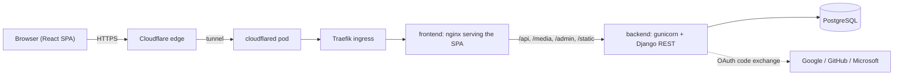

# Track Your Budget

[](https://dev.azure.com/edodevops0169/TackYourBudget/_build)
[](https://track-your-budget.de)
[](LICENSE)

A full-stack personal finance tracker: sign in with Google, GitHub or Microsoft, record income and expenses, and see where the current month's money went. The UI is in English, amounts are in EUR.

**Live:** <https://track-your-budget.de> (any Google, GitHub or Microsoft account works; nothing but the profile the provider shares is stored).

Developed on Azure DevOps (pipelines, pull requests) and mirrored to GitHub. The Kubernetes manifests, Argo CD setup and the operations runbook live in the separate [app-manifests](https://github.com/Track-Your-Budget/manifests-app) repository.

<!-- TODO: add screenshots to docs/screenshots/ and uncomment
## Screenshots

| Dashboard | Transactions |
|---|---|
|  |  |
-->

---

## Features

- **Social sign-in** via Google, GitHub or Microsoft (OAuth 2.0 authorization-code flow, exchanged server-side).
- **Dashboard** for the current month: balance, income and expense cards, a three-month income/expense bar chart, expenses by category, and the eight most recent transactions grouped by month.
- **Transactions page**: the full history, ten rows at a time with "load more", grouped by month, with filters for category, income/expense and period (current month, last two months) plus a debounced search over title and notes.
- **Add, edit and delete** transactions from either page; every write shows a success or error toast.
- **Profile page** showing the account and the avatar pulled from the sign-in provider.
- **Settings page** with quick templates, thresholds and scheduled entries. These tabs are UI prototypes: their state lives in the browser only and is not sent to the API.
- **Per-user data**: every query is scoped to the authenticated user.

---

## Tech Stack

### Frontend (`app-frontend/`)

| Technology | Purpose |
|---|---|
| React 19 + TypeScript | UI |
| Vite | Build tool and dev server |
| React Router 7 | Client-side routing |
| Tailwind CSS v4 + shadcn/ui (Radix) | Styling and components |
| Recharts | Monthly chart |
| react-hook-form | Transaction forms |
| Axios | API client with silent token refresh |
| Prettier + ESLint | Formatting and linting |

### Backend (`backend/`)

| Technology | Purpose |
|---|---|
| Django 6 + Django REST Framework | API |
| djangorestframework-simplejwt | Access and refresh tokens |
| django-allauth + dj-rest-auth | Social login (Google, GitHub, Microsoft) |
| PostgreSQL | Database |
| django-cors-headers | CORS |
| Gunicorn | Production WSGI server |

---

## Architecture



How a change ships: push to `test` or `main` → Azure Pipeline lints, builds both Docker images, pushes them to Docker Hub and commits the new image tags into `app-manifests` → Argo CD notices the commit and rolls the matching overlay out to the test or prod k3s cluster.

### Design decisions

- **Access token in memory, refresh token in an httpOnly cookie.** JavaScript never sees the refresh token, so an XSS cannot steal a long-lived credential; `SameSite=Lax` plus rotation with blacklisting covers CSRF and replay. Nothing is written to `localStorage`.
- **Social sign-in only.** No password storage, no reset flow, no e-mail verification to build and secure. Provider credentials are `SocialApp` rows in the database, not environment variables, so one image serves every environment.
- **One transactions endpoint, pagination opt-in.** Without `limit` the API returns a plain array (dashboard), with `limit` a `{count, next, results}` page (history). Sorting by `-date, -id` keeps pages stable when several rows share a date.
- **Kustomize instead of Helm.** Two overlays that differ in a handful of values do not justify a templating layer; a base plus strategic-merge patches stays readable and diffable.
- **Cloudflare Tunnel for production.** The prod server sits behind a network with no inbound ports. `cloudflared` dials out, Cloudflare terminates TLS at the edge; the cluster never exposes a public port.
- **Django serves `/media/` and `/static/` itself.** A deliberate trade-off for a handful of avatars and the admin's CSS; documented in `backend/backend/urls.py` together with the point at which a real file server should take over.

---

## Project Structure

```
track-your-budget/
├── app-frontend/
│   ├── src/
│   │   ├── app.tsx                  # Routes, auth guard, error boundary, session context
│   │   ├── pages/
│   │   │   ├── dashboard.tsx        # Current-month overview
│   │   │   ├── transactions.tsx     # Paginated, filterable history
│   │   │   ├── profile.tsx / settings.tsx / login.tsx / not-found.tsx
│   │   ├── components/
│   │   │   ├── auth/                # Provider buttons, require-auth
│   │   │   ├── budget/              # Cards, chart, list, filters, modals
│   │   │   ├── layout/              # navbar, page-header, route-error-boundary
│   │   │   ├── profile/ settings/ transactions/
│   │   │   └── ui/                  # shadcn components (generated)
│   │   ├── hooks/
│   │   │   ├── use-auth-session.ts  # Token bootstrap, OAuth exchange, current user, logout
│   │   │   ├── use-session.ts       # Context that shares the one session with every page
│   │   │   ├── use-transaction-mutations.ts
│   │   │   └── use-transaction-details.ts
│   │   └── lib/
│   │       ├── api/                 # Every request: transactions.ts, users.ts
│   │       ├── api-client.ts        # Axios instance + refresh interceptor
│   │       ├── auth/                # Social login call, OAuth callback capture
│   │       ├── format.ts            # Currency, date and category labels
│   │       ├── transaction-filters.ts
│   │       └── types.ts
│   ├── Dockerfile                   # Vite build → nginx, proxies /api to backend
│   └── docker-entrypoint.sh         # Writes env-config.js at container start
├── backend/
│   ├── api/
│   │   ├── models.py                # Transaction, Profile
│   │   ├── serializers.py
│   │   ├── signals.py               # Creates Profile + fetches provider avatar
│   │   ├── urls.py
│   │   ├── views/
│   │   │   ├── auth.py              # Google/GitHub/Microsoft login views
│   │   │   ├── transactions.py      # List/filter/paginate, create, update, delete
│   │   │   ├── summary.py           # Monthly totals for the chart
│   │   │   ├── users.py             # /users/me/
│   │   │   └── health.py            # Kubernetes probe
│   │   ├── management/commands/seed.py  # Sample data
│   │   └── tests.py
│   └── backend/settings.py
├── docker-compose.yml
└── azure-pipelines.yml
```

---

## Getting Started

### Prerequisites

- Node.js 22+
- Python 3.12+
- PostgreSQL
- OAuth apps for at least one of Google, GitHub or Microsoft

### 1. Backend

```bash
cd backend
python -m venv venv
source venv/bin/activate
pip install -r requirements.txt
```

Create `backend/.env`:

```env
DJANGO_SECRET_KEY=change-me
DEBUG=True
ALLOWED_HOSTS=localhost,127.0.0.1

# Where providers send the browser back after login. Must be byte-for-byte
# identical to the redirect_uri registered with each provider and to the one
# inside every VITE_*_LINK URL: no trailing slash, same scheme, same port.
FRONTEND_URL=http://localhost:5173

# Optional; the origin of FRONTEND_URL is always allowed.
CORS_ALLOWED_ORIGINS=http://localhost:5173,http://127.0.0.1:5173

# Set to True behind HTTPS so the refresh cookie is marked Secure.
JWT_AUTH_SECURE=False

POSTGRES_DB=budget_tracker
POSTGRES_USER=budget
POSTGRES_PASSWORD=secret
POSTGRES_HOST=localhost
POSTGRES_PORT=5432
```

```bash
python manage.py migrate
python manage.py createsuperuser
python manage.py runserver
```

The API listens on `http://localhost:8000`.

### 2. Register the OAuth providers

Provider credentials are **not** environment variables. They are allauth `SocialApp` rows:

1. Open `http://localhost:8000/admin/` → **Social applications** → **Add**.
2. Pick the provider (Google, GitHub or Microsoft), paste its client ID and secret, and attach the site with `SITE_ID = 1`.
3. In the provider's console, register `FRONTEND_URL` as the redirect URI.

A login attempt for a provider without a `SocialApp` row returns a JSON `503` and the UI shows "… sign-in is not configured on the server."

### 3. Frontend

```bash
cd app-frontend
npm install
```

Create `app-frontend/.env.local` with the **full authorization URL** of each provider you configured. A button is hidden when its variable is empty.

```env
VITE_GOOGLE_LINK=https://accounts.google.com/o/oauth2/v2/auth?client_id=…&redirect_uri=http://localhost:5173&response_type=code&scope=openid%20email%20profile
VITE_GITHUB_LINK=https://github.com/login/oauth/authorize?client_id=…&redirect_uri=http://localhost:5173&scope=read:user%20user:email
VITE_MICROSOFT_LINK=https://login.microsoftonline.com/common/oauth2/v2.0/authorize?client_id=…&redirect_uri=http://localhost:5173&response_type=code&scope=openid%20email%20profile%20User.Read
```

```bash
npm run dev
```

The app runs on `http://localhost:5173`. The Vite dev server proxies `/api` to `http://127.0.0.1:8000`, so no CORS setup is needed locally.

### 4. Sample data (optional)

```bash
python manage.py seed --user <username>              # last 3 months
python manage.py seed --user <username> --months 6 --per-month 15
python manage.py seed --user <username> --clear --seed 42
```

Every month gets salary, rent and subscriptions plus a random set of everyday expenses; the current month only up to today. `--seed` makes the data reproducible, `--clear` deletes the user's existing transactions first.

---

## Development

| Task | Command |
|---|---|
| Frontend dev server | `npm run dev` |
| Type-check + production build | `npm run build` |
| Lint | `npm run lint` |
| Format / check formatting | `npm run format` / `npm run format:check` |
| Backend tests | `python manage.py test api` (no tests yet, see [Testing](#testing)) |
| Backend system check | `python manage.py check` |
| Sample data | `python manage.py seed --user <username>` |

Prettier is configured in `app-frontend/.prettierrc` (single quotes, no semicolons, 100 columns). The generated `src/components/ui` folder is excluded from formatting.

---

## API

All endpoints live under `/api/`. Authenticated endpoints expect `Authorization: Bearer <access>`.

| Method | Endpoint | Auth | Description |
|---|---|---|---|
| GET | `/health/` | No | Liveness/readiness probe |
| POST | `/google/login/`, `/github/login/`, `/microsoft/login/` | No | Exchange `{ "code": … }` for an access token; sets the refresh cookie |
| POST | `/token/refresh/` | Cookie | Rotate the refresh cookie and return a new access token |
| POST | `/auth/logout/` | Cookie | Blacklist the refresh token and clear the cookie |
| GET | `/users/me/` | Yes | Current user with avatar URL and bio |
| GET | `/transactions/` | Yes | List transactions (see query parameters below) |
| POST | `/transactions/` | Yes | Create a transaction |
| PUT | `/transactions/<id>/` | Yes | Update a transaction |
| DELETE | `/transactions/<id>/` | Yes | Delete a transaction |
| GET | `/monthly-summary/` | Yes | Income and expense totals for the last three months |

### `GET /transactions/` query parameters

| Parameter | Effect |
|---|---|
| `category` | Exact match on the category value |
| `type` | `income` or `expense` |
| `search` | Case-insensitive substring match on title or notes |
| `date_from`, `date_to` | Inclusive `YYYY-MM-DD` bounds; malformed values return `400` |
| `limit`, `offset` | Opt-in pagination; `limit` is capped at 100 |

Without `limit` the response is a plain array, which the dashboard uses for the current month. With `limit` the response is a page:

```json
{ "count": 137, "next": "…?limit=10&offset=10", "previous": null, "results": [ … ] }
```

Rows are ordered by date descending, then id descending, so pages never overlap on same-day entries.

### Transaction shape

```json
{
  "id": 42,
  "title": "Supermarkt",
  "notes": "Wocheneinkauf",
  "amount": 62.35,
  "category": "lebensmittel",
  "date": "2026-09-18",
  "type": "expense"
}
```

`amount` is always positive; the sign comes from `type`.

| Category value | Label |
|---|---|
| `gehalt` | Salary |
| `miete` | Rent |
| `lebensmittel` | Groceries |
| `transport` | Transport |
| `unterhaltung` | Entertainment |
| `versicherung` | Insurance |
| `sonstiges` | Miscellaneous |

---

## Authentication Flow

```
User clicks "Continue with <Provider>"
  → Button stores the provider name in sessionStorage and redirects to VITE_<PROVIDER>_LINK
  → Provider redirects back to FRONTEND_URL?code=…
  → oauth-callback.ts captures the code before React renders and strips it from the URL
  → useAuthSession POSTs { code } to /api/<provider>/login/
  → Backend exchanges the code with the provider using the SocialApp secret
  → Backend returns an access token in the body and sets the httpOnly "jwt-refresh" cookie
  → Access token is kept in memory only; every request sends it as a Bearer header
  → The session loads /api/users/me/ once and shares it with every page via SessionContext
  → On 401, apiClient refreshes via /api/token/refresh/ once and replays queued requests
  → If the refresh fails, the session is cleared and the router redirects to /login
```

- Access tokens live **5 minutes**, refresh tokens **4 days**. Refresh tokens rotate on use and the old one is blacklisted.
- The refresh token never reaches JavaScript; it is an httpOnly, `SameSite=Lax` cookie. Nothing is stored in localStorage.
- On first login a `Profile` is created and the provider's avatar is downloaded into `MEDIA_ROOT/user_<id>/`.

---

## Running with Docker Compose

```bash
docker compose up --build
```

Copy `.env.example` to `.env` next to `docker-compose.yml` and fill it in. Compose reads `DJANGO_SECRET_KEY`, the `POSTGRES_*` values, `FRONTEND_URL` (defaults to `http://localhost:3000`, register that as the redirect URI at the providers) and the three `VITE_*_LINK` URLs from it. The frontend container serves the built SPA on `http://localhost:3000` and proxies `/api`, `/media`, `/admin` and `/static` to the backend service. The provider links are written into `env-config.js` at container start, so the image does not need a rebuild per environment. The backend waits for Postgres, runs migrations and starts Gunicorn; the frontend waits for the backend's health check. Avatars persist in the `backend_media` volume.

After the first start, create the `SocialApp` rows through `http://localhost:3000/admin/` exactly as in [step 2](#2-register-the-oauth-providers).

---

## CI/CD and Environments

### Branch strategy

Feature branch → pull request into `dev` → pull request into `test` → pull request into `main`. Only `test` and `main` are deployed; `dev` is the integration branch for day-to-day work.

| Environment | Branch | URL | Runs on |
|---|---|---|---|
| local | `dev` (any) | `http://localhost:5173` | Vite dev server + `manage.py runserver` |
| test | `test` | `http://dev.track-your-budget.de` (not in public DNS, see the manifests README) | k3s on the dev server, Postgres in-cluster |
| production | `main` | `https://track-your-budget.de` | k3s on the prod server behind a Cloudflare Tunnel, Postgres on the host |

### Pipeline

`azure-pipelines.yml` runs on pushes and pull requests to `main` and `test`:

1. **Lint & Check**: `npm run lint` for the frontend, `manage.py check` and `manage.py test` for the backend. The backend test suite does not exist yet (see [Testing](#testing)), so this stage currently guards against lint errors and broken Django configuration only.
2. **Build & Push**: on `test` and `main` only, both Docker images are built and pushed to Docker Hub tagged with the build id (`main` also updates `latest`).
3. **Update Manifests**: the pipeline clones the separate [app-manifests](https://github.com/Track-Your-Budget/manifests-app) repository and runs `kustomize edit set image` in `overlays/test` or `overlays/prod`. Argo CD on the dev server watches that repository and rolls the new tags out.

---

## Testing

There is no automated test suite yet: `backend/api/tests.py` is empty and the frontend has no test runner. This is the biggest open item. The plan, in order:

1. **Backend** (pytest + pytest-django, Postgres service container in the pipeline): user isolation on every endpoint, the `GET /transactions/` filters and pagination contract, the monthly summary across a year boundary, and the JSON `503` for an unconfigured provider.
2. **Frontend** (Vitest + Testing Library + msw): the date helpers in `lib/utils.ts`, the filter-to-query mapping, the OAuth callback capture and the 401-refresh queue in `lib/api-client.ts`.
3. **Smoke test** (Playwright) against the test environment after each deployment.

Until then, `npm run build` (type-check) and `npm run lint` are the gates for the frontend, `manage.py check` for the backend.

---

## Known Limitations and Roadmap

Known limitations:

- The **Settings** page (quick templates, limits, scheduled entries) is a UI preview; its state is not persisted.
- Categories are a fixed set; users cannot define their own.
- Both clusters are single-node and there is no automated database backup yet.
- Secrets are applied to the clusters by hand from templates; the Argo CD `Application` objects are not stored in Git.
- No rate limiting on the login endpoints.

Roadmap, roughly in order: automated tests and a GitHub Actions workflow, user-defined categories, budgets per category with warnings on the dashboard, recurring transactions, CSV import, a database backup job, dark mode.

---

## Notes

- `DEBUG` defaults to `False`; set `DEBUG=True` only in `backend/.env` for local development.
- `/media/` and `/static/` are served by Django in every environment so avatars and the admin panel work behind the nginx proxy.
- `MEDIA_ROOT` must stay a dedicated directory; it is exposed under `/media/`.

---

## License

[MIT](LICENSE)
